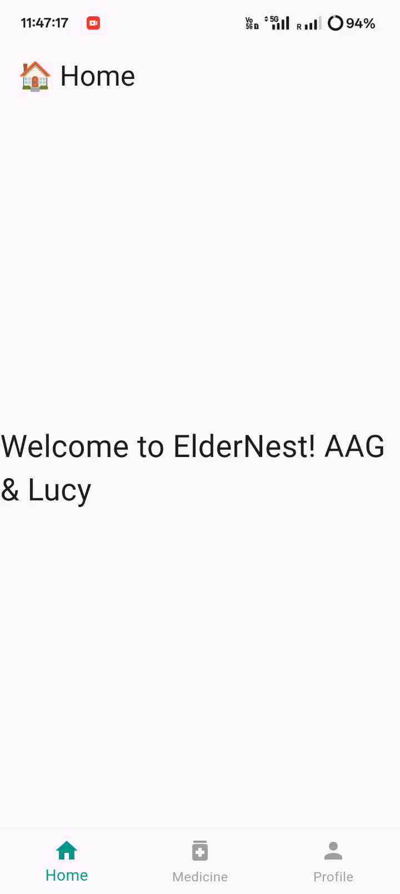
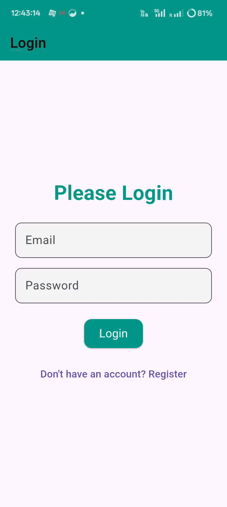

# 👴 ElderlyCare App – Build Log

> 📱 A self-taught full-stack Flutter + Node.js mobile app project  
> 🛠️ Built in public to document and teach myself while helping others learn

---

## 📆 Day 1 – 16th July 2025

### ✅ Flutter Environment Setup

```bash
flutter doctor
```


- Installed **Flutter SDK**.
- Added Flutter to system `PATH` (environment variables).
- Verified installation:


---

### ✅ VS Code Setup

Installed VS Code.

Installed extensions:

- Flutter

- Dart


---

### ✅ Flutter Doctor Dependencies

Ran flutter doctor.

❌ Android Studio not installed → installed it manually.


---

### ✅ Android Studio Setup


Opened SDK Manager in Android Studio.

Installed:

Android SDKs (Android 15, 14, etc.)


NDK (Native Development Kit)


---

### ✅ First App Run on Chrome

Created project: ElderlyCare

Ran:

```bash
flutter run -d chrome
```
App opened successfully in Chrome browser.




---

###  ✅ Build & Install APK

Tried flutter release (incorrect)

Correct command:

```bash
flutter build apk
```

Faced SDK error → fixed after Android Studio setup.

APK path:

```markdown
build/app/outputs/flutter-apk/app-release.apk
```

Installed APK on phone to test basic functionality.


---

## 📆 Day 2 – 17th July 2025

###  ✅ Bottom Navigation Tabs Setup

Updated `main.dart` with bottom nav tabs:

- Home

- Medicine

- Profile

- Menu (added later)


```bash
final List<Widget> _screens = [HomeTab(), MedicineTab(), ProfileTab(), MenuTab()];
```
Used `setState()` to switch tabs.


Issue: Forgot to add MenuTab() in list → fixed.


---

###  ✅ Login Page (login.dart)

Created using `StatelessWidget`

Components:

`Scaffold` with `TextField`, `TextButton`, and `ElevatedButton`

Redirect to Register:


```bash 
Navigator.pushNamed(context, '/register');
```

Explanation:
`Navigator.pushNamed()` navigates to a new route using a string key.


---

### ✅ Registration Page (`register.dart`)

Created RegisterScreen with:

`Name`, `Email`, `Password` fields

Submit using ElevatedButton


```bash
Navigator.pushReplacementNamed(context, '/home');
```

Explanation:
`pushReplacementNamed()` navigates and removes the current screen from history (used post-login).


---

### ✅ App-Wide Styling (app_style.dart)

Common styles created:

`textFieldDecoration`

`buttonStyle`

`commonPadding`


```bash
class AppStyle {
  static const textFieldDecoration = InputDecoration(...);
  static final buttonStyle = ElevatedButton.styleFrom(...);
}
```


---

###  ✅ Defined Routes in main.dart

```bash 
MaterialApp(
  initialRoute: '/login',
  routes: {
    '/login': (context) => LoginScreen(),
    '/register': (context) => RegisterScreen(),
    '/home': (context) => HomeScreen(),
    '/menu': (context) => MenuScreen(),
  },
);
```


---

###  ✅ Logout Button in MenuTab

```bash
ElevatedButton(
  onPressed: () {
    Navigator.pushReplacementNamed(context, '/login');
  },
  child: Text("Logout"),
);
```

Explanation:
Returns to login screen and clears navigation stack.


##  ✅ App Release 2 <!--  [Download APK](https://github.com/amanasish/Elderly-Nest/raw/main/apk%20Releases/apk%20release%202.apk) -->





---

# ⚙️ Backend Setup – Node.js + MongoDB

### ✅ Node Project Initialization

Created `backend/` folder

Ran:

```bash
npm init -y
```

Installed dependencies:

```bash
npm install express mongoose
```


---

### ✅ Created server.js

```bash
const express = require('express');
const mongoose = require('mongoose');
const app = express();
const PORT = 3000;

app.use(express.json());

app.get('/', (req, res) => {
  res.send('Server is running');
});

app.listen(PORT, () => {
  console.log(`Server running on http://localhost:${PORT}`);
});
```

Explanation:

`express()` sets up server

`mongoose` connects to `MongoDB` (next step)

`express.json()` allows parsing `JSON` data

`app.listen()` starts server at `localhost:3000`


---

### ✅ MongoDB Setup

Installed MongoDB application

Yet to configure connection in backend (coming Day 3)


---

### 📁 Project Structure (So Far)

```bash 
lib/
  ├── main.dart
  ├── login.dart
  ├── register.dart
  ├── app_style.dart
backend/
  ├── server.js
  ├── package.json
  ├── node_modules/
```

---

🧭 Next Plan (18 July)

Connect MongoDB with backend

Create user login/register APIs

Setup HTTP request in Flutter frontend

Handle form data submission


